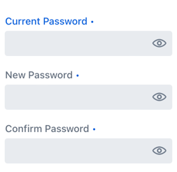
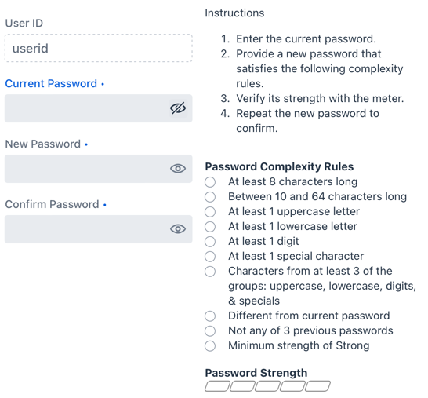
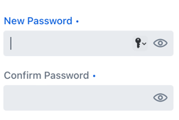
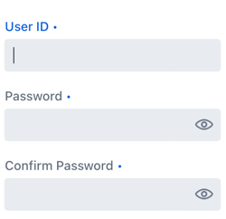
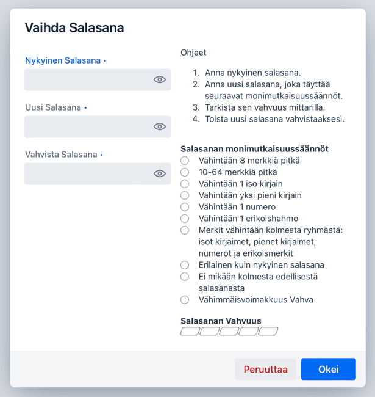

# Change Password Panel & Dialog

## Synopsis

A panel component and dialog for changing known passwords, forgotten passwords, and establishing the user ID and password for a new account. Supports user-defined complexity criteria, strength scoring, and internationalization.

## Description

ChangePassword is a prebuilt set of components for use in your application where a new password must be provided and confirmed. It is available as a panel and a dialog. It supports multiple uses cases, including those for users needing to change their known passwords, for users who have forgotten their passwords, and for users who need to establish both their user ID and password for a new account.

Both the user ID and new/desired password fields support the adding of rules to match your application's requirements. It provides several prebuilt rules and support for adding custom rules as well. Each rule displays next to the input fields and gives the user feedback on if it has been satisfied.

In addition to displaying the password rules, ChangePassword can also display the password's strength by supplying a password scorer, such as the [Zxcvbn](https://github.com/dropbox/zxcvbn)—a password strength scorer for English.

The component's internationalization support can be used to customize the text labels either to an alternate language or to different English text.

## Components

### ChangePasswordPanel

The `ChangePasswordPanel` component was designed to be used wherever it is needed in an application, such as in a view or in a dialog. It provides the fields for password changing, but it does not include any buttons.

In its simplest form `ChangePasswordPanel` has only one column. This column consists of fields for entry of a user ID, a current password, a desired password, and a confirm password. The mode of the panel (see below) determines which fields are displayed.


In its most comprehensive form, `ChangePasswordPanel` has two columns. The left column is the same as in the simplest form. The right column can contain any or all of the following: instructions for the use of the component, user ID rules, password rules, and a strength meter. (In the image below, the left column is also displaying the optional user ID.)


`ChangePasswordPanel` has three modes,

  - `CHANGE_FORGOTTEN` - to use when the current password is not known - displays desired and confirm password fields. 
  - `CHANGE_KNOWN` - to use when the current password is known - displays known, desired, and confirm password fields. This mode can also be used for a forgotten password if the user has a temporary password to enter. Simply change the current password label to "Temporary Password". 
  - `ESTABLISH_NEW` - to use when there is no user id nor current password - displays userid, desired, and confirm password fields. This mode can also be used for a forgotten password if the user has a one time passcode to enter. Simply change the user ID label to "One Time Passcode". 

### ChangePasswordDialog

`ChangePasswordDialog` is a convenience dialog wrapper around `ChangePasswordPanel`. In addition to the panel, it includes a customizable header, buttons for canceling and submitting, and event listeners for the button clicks.


## Label Customization and Internationalization

By default, all ChangePassword labels are in English. If you need your labels in another language or need alternate English labels, use the `ChangePasswordI18n` class to specify the new labels.


## Example Usage

### Simple View

Panel, no instructions, no rules, no meter. Buttons and layout were added to provide interaction and organization.

```
@Route(value = "change-password, layout = ChangePasswordLayout.class)
public class ChangePasswordView extends Composite<VerticalLayout> {
    private final ChangePasswordPanel changePasswordPanel;
    private final Button clearButton;
    private final Button okButton;

    public ChangePasswordView() {
        changePasswordPanel = new ChangePasswordPanel(ChangePasswordType.CHANGE_KNOWN);

        clearButton = new Button("Clear");
        clearButton.addThemeVariants(ButtonVariant.LUMO_ERROR);
        clearButton.addClickListener(this::onClearClick);

        okButton = new Button("OK");
        okButton.addThemeVariants(ButtonVariant.LUMO_PRIMARY);
        okButton.addClickListener(this::onOkClick);

        var buttonBar = new HorizontalLayout();
        buttonBar.setWidthFull();
        buttonBar.setJustifyContentMode(FlexComponent.JustifyContentMode.END);
        buttonBar.add(clearButton);
        buttonBar.add(okButton);

        var content = getContent();
        content.setSizeUndefined();
        content.add(changePasswordPanel);
        content.add(buttonBar);
    }

    private void onClearClick(ClickEvent<Button> event) {
        changePasswordPanel.reset();
    }

    private void onOkClick(ClickEvent<Button> event) {
        if (changePasswordPanel.isValid()) {
            Notification.show("Desired Password is: %s".formatted(changePasswordPanel.getDesiredPassword()));
        }
    }
}
```

### Simple Dialog

Dialog, no instructions, no rules, no meter. Because the buttons and layout are contained within the dialog, its usage is much simpler than the panel.

```
var changePasswordDialog = new ChangePasswordDialog(ChangePasswordType.CHANGE_KNOWN);
changePasswordDialog.addOkListener(e -> Notification.show("New password is \"%s\"".formatted(e.getDesiredPassword())));
changePasswordDialog.open();
```

### Show a Read-Only User ID

Valid only for `CHANGE_FORGOTTEN` and `CHANGE_KNOWN` modes to show a read-only user ID to give the user context for what user's password is being changed. Note that for `ESTABLISH_NEW` mode, the user ID field is always shown and is read/write.

```
changePasswordPanel.setUserid("userid");

```

### Show Instructions

```
changePasswordPanel.setInfoText(new Html("""
    <span>
        Instructions
        <ol>
            <li>Enter the current password.
            <li>Provide a new password that satisfies the following complexity rules.
            <li>Verify its strength with the meter.
            <li>Repeat the new password to confirm.
        </ol>
    </span>"""));
```

### Show Password Complexity Rules

ChangePassword includes several built-in rules. They can be used for both passwords and user IDs. The rules include:
- minimum length
- length range
- has uppercase letters
- has lowercase letters
- has digits
- has special characters
- has characters from character groups
- is different from current password
- is different from N previous passwords
- is at least a certain strength

In addition, a custom rule can be implemented by creating an instance of `ChangePasswordRule`.

```
changePasswordPanel.addPasswordRule(ChangePasswordRule.length(8));
changePasswordPanel.addPasswordRule(ChangePasswordRule.length(10, 64));
changePasswordPanel.addPasswordRule(ChangePasswordRule.hasUppercaseLetters(1));
changePasswordPanel.addPasswordRule(ChangePasswordRule.hasLowercaseLetters(1));
changePasswordPanel.addPasswordRule(ChangePasswordRule.hasDigits(1));
changePasswordPanel.addPasswordRule(ChangePasswordRule.hasSpecials(1));
changePasswordPanel.addPasswordRule(ChangePasswordRule.hasCharacterGroups(3));
changePasswordPanel.addPasswordRule(ChangePasswordRule.different(passwordEncoder,
        passwordEncoder.apply("user")));
changePasswordPanel.addPasswordRule(ChangePasswordRule.notPreviousOf(passwordEncoder,
        passwordEncoder.apply("first"),
        passwordEncoder.apply("second"),
        passwordEncoder.apply("third")));
changePasswordPanel.addPasswordRule(ChangePasswordRule.strengthOf(PasswordStrengthLevel.STRONG,
        changePasswordPanel.getChangePasswordI18n(),
        desiredPassword -> ChangePasswordUtil.guessesToPasswordStrengthLevel(zxcvbn.measure(desiredPassword).getGuesses())));
```

### Show User ID Rules

```
changePasswordPanel.addUseridRule(ChangePasswordRule.startWithLetter());
changePasswordPanel.addUseridRule(ChangePasswordRule.length(10, 20));
changePasswordPanel.addUseridRule(new ChangePasswordRule("Only letters, digits, and dots",
        password -> password.matches("[\\p{Alnum}.]*")));
```

### Show the Password Strength Meter

This example usage uses the Zxcvbn password strength scorer.

```
changePasswordPanel.setScorer(desiredPassword -> {
    var strength = zxcvbn.measure(desiredPassword);
    return new PasswordStrength(ChangePasswordUtil.guessesToPasswordStrengthLevel(strength.getGuesses()),
            "Could take %s to crack. %s".formatted(
                    strength.getCrackTimesDisplay().getOfflineSlowHashing1e4perSecond(),
                    strength.getFeedback().getWarning()));
});
```
