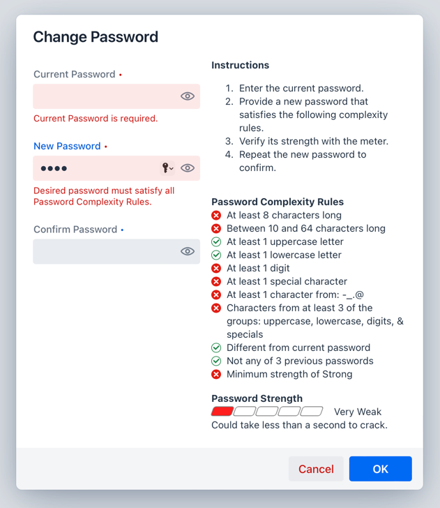

# Change Password Panel & Dialog

## Synopsis

A panel component and dialog for changing known passwords, forgotten passwords, and establishing the user ID and password for a new account. Supports user-defined complexity criteria, strength scoring, and internationalization.

## Description

ChangePassword is a set of components for use in your application where a new password must be provided and confirmed. It is available as a panel and a dialog. It supports multiple uses cases, including those for users needing to change their known passwords, for users who have forgotten their passwords, and for users who need to establish both their user ID and password for a new account.

Both the user ID and new/desired password fields support the adding of rules to match your application's requirements. It provides several prebuilt rules and support for adding custom rules as well. Each rule displays next to the input fields and gives the user feedback on if it has been satisfied.

In addition to displaying the password rules, ChangePassword can also display the password's strength by supplying a password scorer, such as the [Zxcvbn](https://github.com/dropbox/zxcvbn)—a password strength scorer for English.

The component's internationalization support can be used to customize the text labels either to an alternate language or to different English text.

## Components

### ChangePasswordPanel

The `ChangePasswordPanel` component was designed to be used wherever it is needed in an application, such as in a view or in a dialog. It provides the fields for password changing, but it does not include any buttons.

#### Most Simple Form

In its simplest form `ChangePasswordPanel` has only one column. This column consists of fields for entry of a user ID, a current password, a desired password, and a confirm password. The mode of the panel (see below) determines which fields are displayed. <br>

#### Most Comprehensive Form

In its most comprehensive form, `ChangePasswordPanel` has two columns. The left column is the same as in the simplest form. The right column can contain any or all of the following:
- instructions for the use of the component,
- user ID rules,
- password rules, and
- a strength meter.


In the image above, the left column is also displaying the optional user ID. And please note this example is intended to show the _variety_ of redefined rules available in the component—not a recommended set of complexity rules!

### ChangePasswordDialog

`ChangePasswordDialog` is a convenience dialog wrapper around `ChangePasswordPanel`. In addition to the panel, it includes a customizable header, buttons for canceling and submitting, and event listeners for the button presses. <br>


## ChangePassword Rules

ChangePassword utilizes rules for userid and password validation. Included with ChangePassword are several predefined rules. The predefined rules include those for:

- minimum length: <br>`ChangePasswordRule.length(8)`
- length range: <br>`ChangePasswordRule.length(10, 64)`
- has uppercase letters: <br>`ChangePasswordRule.hasUppercaseLetters(1)`
- has lowercase letters: <br>`ChangePasswordRule.hasLowercaseLetters(1)`
- has digits: <br>`ChangePasswordRule.hasDigits(1)`
- has special characters: <br>`ChangePasswordRule.hasSpecials(1)`
- has specified characters: <br>`ChangePasswordRule.hasSpecifieds("-_.@", 1)`
- has only specified characters: <br>`ChangePasswordRule.hasOnly("-\\p{Alnum}.", "Only letters, digits, dots, and dashes")`
- has characters from multiple character groups: <br>`ChangePasswordRule.hasCharacterGroups(3)`
- is different from current password: <br>`ChangePasswordRule.different(passwordEncoder,
  passwordEncoder.apply("user"))`
- is different from previous passwords: <br>`ChangePasswordRule.notPreviousOf(passwordEncoder,
  passwordEncoder.apply("first"),
  passwordEncoder.apply("second"),
  passwordEncoder.apply("third"))`
- is at least a certain strength: <br>`ChangePasswordRule.strengthOf(PasswordStrengthLevel.STRONG,
  changePassword.getChangePasswordI18n(),
  desiredPassword -> ChangePasswordUtil.guessesToPasswordStrengthLevel(zxcvbn.measure(desiredPassword).getGuesses()))`

In addition, a custom rule can be implemented by creating an instance of `ChangePasswordRule` and supplying it with a description and rule function.

```
    new ChangePasswordRule("Only letters, digits, and dots",
            password -> password.matches("[\\p{Alnum}.]*"))
```

Here is what the dialog looks like after tabbing out of the "Current Password" field and typing "This" into the "New Password" field: <br>

<br>Now that the password is being entered, each of the rules show their pass/fail status instead of an empty circle. Those that have passed show a green checkmark, whereas those that have failed show a red ex.

## ChangePassword Modes

ChangePassword has three modes,

- `CHANGE_FORGOTTEN` - to use when the current password is not known. <br>This mode displays the desired and confirm password fields. <br>
- `CHANGE_KNOWN` - to use when the current password is known. <br>This mode displays the known, desired, and confirm password fields. It can also be used for a forgotten password if the user has been provided a temporary password. Simply change the "Current Password" label to "Temporary Password". <br>
- `ESTABLISH_NEW` - to use when there is no user id nor current password. <br>This mode displays the userid, desired, and confirm password fields. It can also be used for a forgotten password if the user has been provided a one time passcode (OTP). Simply change the "User ID" label to "One Time Passcode". <br>

## Label Customization and Internationalization

By default, all ChangePassword labels are in English. If you need your labels in another language or need alternate English labels, use the `ChangePasswordI18n` class to specify the new labels. <br>

## Example Usage

Below are example usages of ChangePassword. First is one using `ChangePasswordPanel` in a very simple view, followed by a `ChangePasswordDialog` example. Subsequent examples apply to and build on these simple example usages.

### Simple View

This example uses the `ChangePasswordPanel`. Because it is only a panel, it must be added to something, like this view, for it to be useful. If no `ChangePasswordMode` is specified to its constructor, it defaults to `CHANGE_KNOWN`.

As this example makes no additional `ChangePasswordPanel` initializations, it will only display the input fields—no instructions, no rules, and no meter will be displayed.

Buttons were added to the view to provide some user interaction with the panel.

```
@Route(value = "change-password, layout = ChangePasswordLayout.class)
public class ChangePasswordView extends Composite<VerticalLayout> {
    private final ChangePasswordPanel changePassword;
    private final Button clearButton;
    private final Button okButton;

    public ChangePasswordView() {
        changePassword = new ChangePasswordPanel();

        clearButton = new Button("Clear");
        clearButton.addThemeVariants(ButtonVariant.LUMO_ERROR);
        clearButton.addClickListener(event -> changePassword.reset());

        okButton = new Button("OK");
        okButton.addThemeVariants(ButtonVariant.LUMO_PRIMARY);
        okButton.addClickListener(event -> {
            if (changePassword.isValid()) {
                Notification.show("Desired Password is: %s".formatted(changePassword.getDesiredPassword()));
            }
        });

        var buttonBar = new HorizontalLayout();
        buttonBar.setWidthFull();
        buttonBar.setJustifyContentMode(FlexComponent.JustifyContentMode.END);
        buttonBar.add(clearButton);
        buttonBar.add(okButton);

        var content = getContent();
        content.setSizeUndefined();
        content.add(changePassword);
        content.add(buttonBar);
    }
}
```


### Simple Dialog

This example uses the `ChangePasswordDialog` component. Like the `ChangePasswordPanel` component, if no `ChangePasswordMode` is specified to its constructor, it defaults to `CHANGE_KNOWN`.

As this example also makes no additional `ChangePasswordDialog` initializations, it will only display the input fields of the `ChangePasswordPanel` component—no instructions, no rules, and no meter will be displayed—but because it is a dialog, it will display a dialog header and buttons.

As the buttons and layout are contained within the dialog, you can see its usage is much simpler than that of the panel.

```
    var changePassword = new ChangePasswordDialog();
    changePassword.addOkListener(e -> Notification.show("Desired password is \"%s\"".formatted(e.getDesiredPassword())));
    changePassword.open();
```


### Show a Read-Only User ID

Normally, the `CHANGE_FORGOTTEN` and `CHANGE_KNOWN` modes do not show the User ID field. However, if you supply a userid, it will show a read-only user ID. This can be useful to give the user context for what user's password is being changed.

```
    changePassword.setUserid("userid");

```


_Note that for `ESTABLISH_NEW` mode, the User ID field is always shown and is writeable._

### Show Instructions

Instructions for use of the component can be displayed at the top of the right column. Use the `setInfoText` method to provide the instructions either as a component (as shown below) or as a text string.

```
    changePassword.setInfoText(new Html("""
        <span>
            <span class="change-password-heading">Instructions</span>
            <ol>
                <li>Enter the current password.
                <li>Provide a new password that satisfies the following complexity rules.
                <li>Verify its strength with the meter.
                <li>Repeat the new password to confirm.
            </ol>
        </span>"""));
```


### Show User ID Rules

If there are no userid rules supplied, the User ID Rule section is hidden. In order to display the section and its rules, simply add the rules to the component with either the `setUseridRules()` or the `addUseridRules()` method. For example:

```
        changePasswordPanel.addUseridRules(ChangePasswordRule.startsWithLetter());
        changePasswordPanel.addUseridRules(ChangePasswordRule.length(10, 20));
```


Initially the rule validation indicator (the circle next to the rule description) is empty, but as the user types, the rule validation indicator shows either a red ex—indicating the rule is not satisfied or a green checkmark—indicating the rule is satisfied.


### Show Password Complexity Rules

If there are no password rules supplied, the Password Complexity Rules section is hidden. In order to display the section and its rules, simply add the rules to the component with either the `setPasswordRules()` or the `addPasswordRules()` method. For example:

```
    changePassword.addPasswordRules(ChangePasswordRule.length(8));
```


### Show the Password Strength Meter

If a password strength scorer is supplied, the password strength meter is displayed. (The following example usage uses the Zxcvbn password strength scorer.)

```
    changePassword.setScorer(desiredPassword -> {
        var strength = zxcvbn.measure(desiredPassword);
        return new PasswordStrength(ChangePasswordUtil.guessesToPasswordStrengthLevel(strength.getGuesses()),
                "Could take %s to crack. %s".formatted(
                        strength.getCrackTimesDisplay().getOfflineSlowHashing1e4perSecond(),
                        strength.getFeedback().getWarning()));
    });
```


